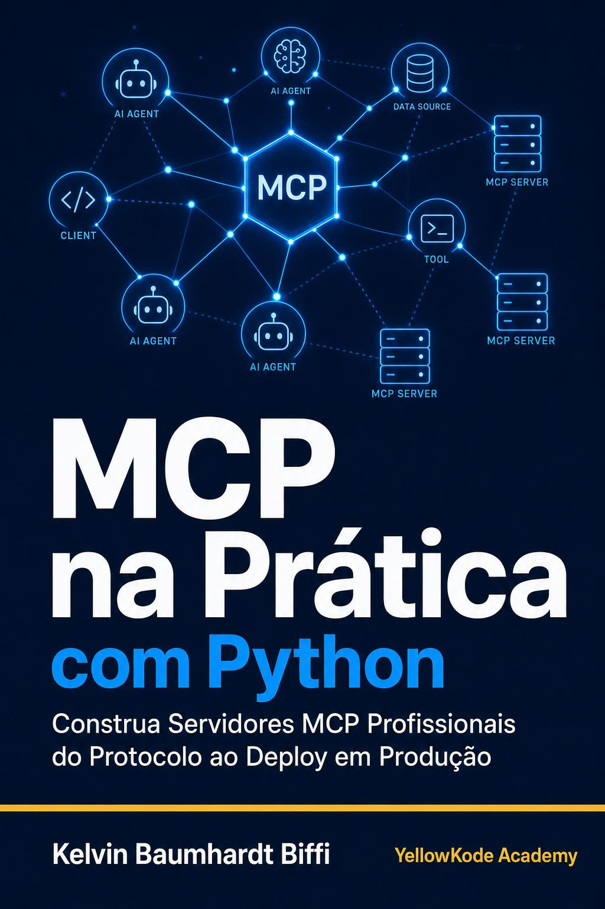

<p align="center">
  
</p>

<h1 align="center">MCP na Prática com Python</h1>

<p align="center">
  Repositório companion do livro publicado por
  <a href="https://github.com/kelvinbiffi">@kelvinbiffi</a>
  e <a href="https://github.com/YellowKode-Academy">@YellowKode-Academy</a>
</p>

<p align="center">
  <a href="https://www.amazon.com.br">Disponível na Amazon KDP</a>
</p>

---

## Sobre este repositório

Contém todo o código Python referenciado no livro, do capítulo 1 ao 12. Cada diretório `cap-XX/` contém o estado do projeto ao final daquele capítulo, mostrando o que foi adicionado ou modificado.

O projeto central do livro é um servidor MCP de inteligência de mercado, construído peça por peça. No final, o servidor integra tools async com fallback, Resources, Prompts, autenticação JWT, observabilidade com Prometheus, testes E2E do protocolo MCP e deploy com Docker e CI/CD no Railway.

## Setup

```bash
git clone https://github.com/YellowKode-Academy/mcp-na-pratica
cd mcp-na-pratica/cap-01
python -m venv .venv
source .venv/bin/activate
# Windows: .venv\Scripts\activate
pip install -r requirements.txt
cp .env.example .env
# Edite .env com suas chaves de API
```

## Variáveis de ambiente

Copie `.env.example` para `.env` e preencha:

```
ANTHROPIC_API_KEY=sk-ant-...
SERPAPI_KEY=...               # necessário a partir do cap-03
JWT_SECRET=...                # necessário a partir do cap-06
PROMETHEUS_PORT=9090          # opcional, padrão 9090
LANGCHAIN_API_KEY=ls__...     # opcional, para LangSmith
```

## Estrutura por capítulo

| Capítulo | Diretório | O que você constrói |
|---|---|---|
| 1 | `cap-01/` | Servidor MCP mínimo com 2 tools via stdio |
| 2 | `cap-02/` | Protocolo JSON-RPC: 3 tools com `listar_categorias` |
| 3 | `cap-03/` | Tools async com SerpAPI, fallback local e retry |
| 4 | `cap-04/` | As 3 primitivas MCP: Tools, Resources e Prompts |
| 5 | `cap-05/` | Transport HTTP/SSE com FastAPI, `/health` e `/ready` |
| 6 | `cap-06/` | Autenticação JWT com middleware e `generate_token.py` |
| 7 | `cap-07/` | Integração com Claude Desktop e Cursor |
| 8 | `cap-08/` | Agente LangChain consumindo o servidor via MCP |
| 9 | `cap-09/` | Observabilidade: structlog, Prometheus e rate limiting |
| 10 | `cap-10/` | Testes unitários, de integração e E2E do protocolo MCP |
| 11 | `cap-11/` | Container Docker multi-stage com health check nativo |
| 12 | `cap-12/` | CI/CD completo com GitHub Actions e deploy no Railway |

## Autor

Criado por [@kelvinbiffi](https://github.com/kelvinbiffi) para a série de livros técnicos da [@YellowKode-Academy](https://github.com/YellowKode-Academy).
